# Design Modelling

## UML Models Overview

This document provides comprehensive UML visual models for the Unified Patient Access & Clinical Intelligence Platform. The diagrams translate requirements from [spec.md](.propel/context/docs/spec.md) and architectural decisions from [design.md](.propel/context/docs/design.md) into visual representations that guide implementation.

**Diagram Organization:**
- **System Context**: Shows the platform boundary and interactions with external actors (patients, staff, admins) and services (Azure OpenAI, calendar APIs, notification services)
- **Component Architecture**: Visualizes the modular monolith structure with patient-access and clinical-intelligence bounded contexts
- **Deployment Architecture**: Documents Windows/IIS hosting with PostgreSQL, Upstash Redis, and Azure OpenAI infrastructure
- **Data Flow**: Traces data movement through booking workflows, document processing pipeline, and RAG-based extraction
- **Logical Data Model (ERD)**: Defines the 10 core entities and their relationships
- **Sequence Diagrams**: One diagram per use case (UC-001 through UC-006) showing detailed interaction flows

These models support development, testing, and operational understanding of how the platform achieves 99.9% uptime, 2-minute chart prep, and >98% AI-human agreement targets.

## Architectural Views

### System Context Diagram
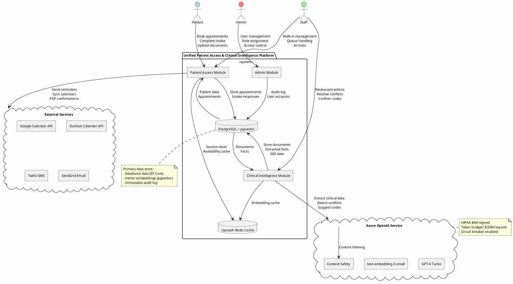

### Component Architecture Diagram
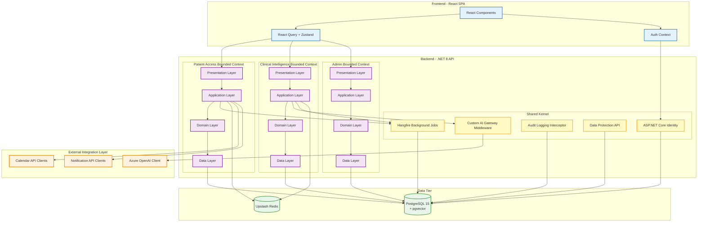

### Deployment Architecture Diagram
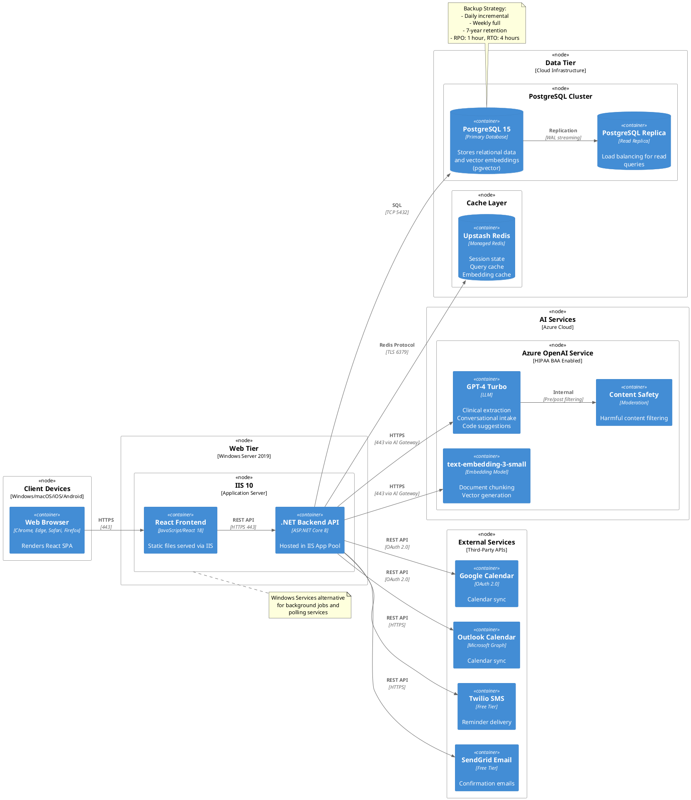

### Data Flow Diagram
```plantuml
@startuml
!define RECTANGLE_STYLE skinparam roundcorner 10

skinparam defaultFontSize 10
skinparam backgroundColor #FEFEFE

title Data Flow - Booking and Clinical Intelligence Workflows

' External entities
rectangle "Patient" as Patient #LightBlue
rectangle "Staff" as Staff #LightGreen
rectangle "Azure OpenAI" as AI #FFE0B2

' Processes
rectangle "P1\nBook Appointment" as P1 #E3F2FD
rectangle "P2\nComplete Intake" as P2 #E3F2FD
rectangle "P3\nUpload Document" as P3 #E1F5FE
rectangle "P4\nExtract Clinical Data" as P4 #E1F5FE
rectangle "P5\nAssemble 360 View" as P5 #E1F5FE
rectangle "P6\nDetect Conflicts" as P6 #E1F5FE
rectangle "P7\nSuggest Codes" as P7 #E1F5FE
rectangle "P8\nVerify & Confirm" as P8 #E8F5E9
rectangle "P9\nSend Reminders" as P9 #FFF3E0
rectangle "P10\nManage Swap Watchlist" as P10 #FFF3E0
rectangle "P11\nCalculate No-Show Risk" as P11 #FFF3E0

' Data stores
database "D1\nPatient DB" as D1 #C8E6C9
database "D2\nAppointment DB" as D2 #C8E6C9
database "D3\nIntake DB" as D3 #C8E6C9
database "D4\nDocument Store" as D4 #B3E5FC
database "D5\nExtracted Facts DB" as D5 #B3E5FC
database "D6\nPatient View DB" as D6 #B3E5FC
database "D7\nCode Suggestions DB" as D7 #B3E5FC
database "D8\nAudit Log" as D8 #FFCCBC
database "D9\nRedis Cache" as D9 #FFF9C4
database "D10\nVector Store\n(pgvector)" as D10 #B2DFDB

' External outputs
rectangle "Google/Outlook\nCalendar" as ExtCal #FCE4EC
rectangle "SMS/Email\nServices" as ExtNotif #FCE4EC

' Flow 1: Booking workflow
Patient --> P1 : Search availability
P1 --> D9 : Check cached slots
P1 --> D2 : Read available slots
P1 --> P11 : Patient signals
P11 --> D1 : Read history
P11 --> D9 : Cache risk score
P1 --> D2 : Create appointment
P1 --> D1 : Update patient
P1 --> D8 : Log booking event

P2 --> P1 : Intake data
Patient --> P2 : Submit answers\n(conversational/manual)
P2 --> D3 : Store intake response
P2 --> D8 : Log intake event

P1 --> P9 : Trigger confirmation
P9 --> ExtNotif : Send SMS/Email
P9 --> ExtCal : Create calendar event
P9 --> D8 : Log notification

P1 --> P10 : Register preferred slot
P10 --> D2 : Monitor slot changes
P10 --> P1 : Swap on availability

' Flow 2: Document processing pipeline
Patient --> P3 : Upload PDF
Staff --> P3 : Associate with encounter
P3 --> D4 : Store original file
P3 --> D8 : Log upload

P3 --> P4 : Queue extraction job
P4 --> D10 : Chunk + embed document
P4 --> AI : Extract facts via RAG
AI --> P4 : Structured output
P4 --> D5 : Store extracted facts\n+ confidence scores
P4 --> D8 : Log extraction

P4 --> P5 : New facts available
P5 --> D5 : Read all facts
P5 --> D10 : Semantic similarity search
P5 --> D6 : Update 360 view (JSONB)
P5 --> P6 : Check for conflicts

P6 --> D5 : Compare fact values
P6 --> D6 : Flag conflicts
P6 --> D8 : Log conflict detection

P5 --> P7 : Consolidated view ready
P7 --> AI : Generate code suggestions
AI --> P7 : ICD-10 + CPT codes
P7 --> D7 : Store suggestions\n+ evidence links

' Flow 3: Verification workflow
Staff --> P8 : Review patient view
P8 --> D6 : Read 360 view
P8 --> D5 : Read source facts
P8 --> D7 : Read code suggestions
Staff --> P8 : Confirm/reject
P8 --> D6 : Update verification status
P8 --> D7 : Update review flags
P8 --> D8 : Log verification

@enduml
```

### Logical Data Model (ERD)
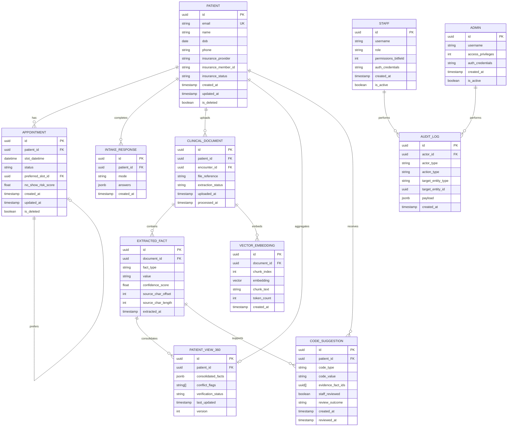

### Use Case Sequence Diagrams

> **Note**: Each sequence diagram below corresponds to one use case (UC-001 through UC-006) from [spec.md](.propel/context/docs/spec.md). Diagrams show detailed message flows including actors, system components, and data stores interactions.

#### UC-001: Patient Books an Appointment and Completes Intake
**Source**: [spec.md#UC-001](.propel/context/docs/spec.md#UC-001)

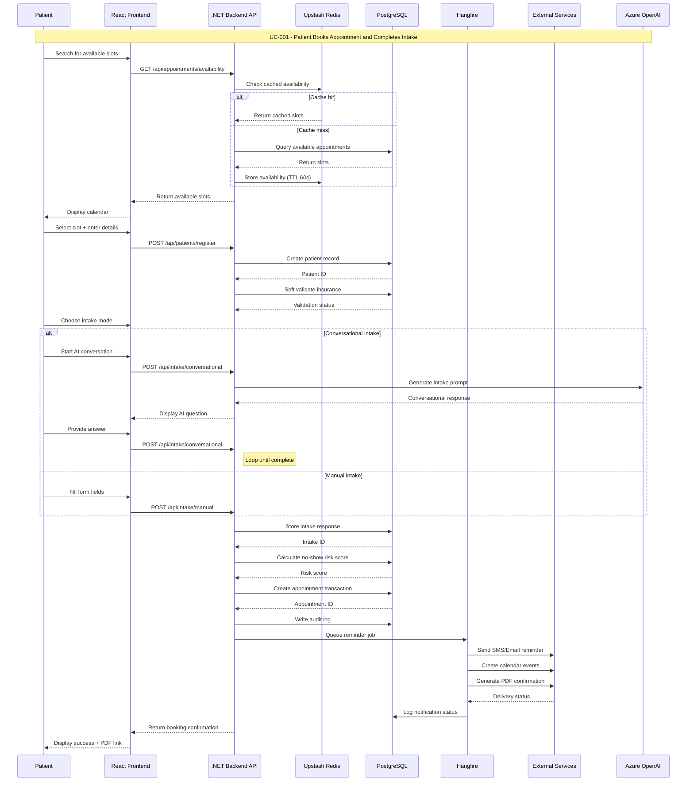

#### UC-002: Patient Requests a Preferred Slot Swap
**Source**: [spec.md#UC-002](.propel/context/docs/spec.md#UC-002)

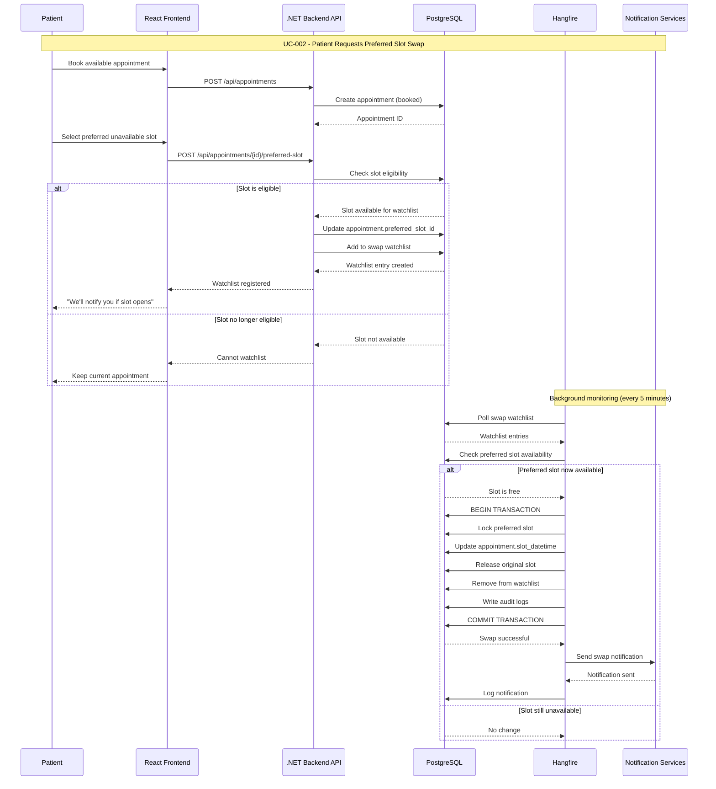

#### UC-003: Staff Books a Walk-In and Manages Same-Day Arrival
**Source**: [spec.md#UC-003](.propel/context/docs/spec.md#UC-003)

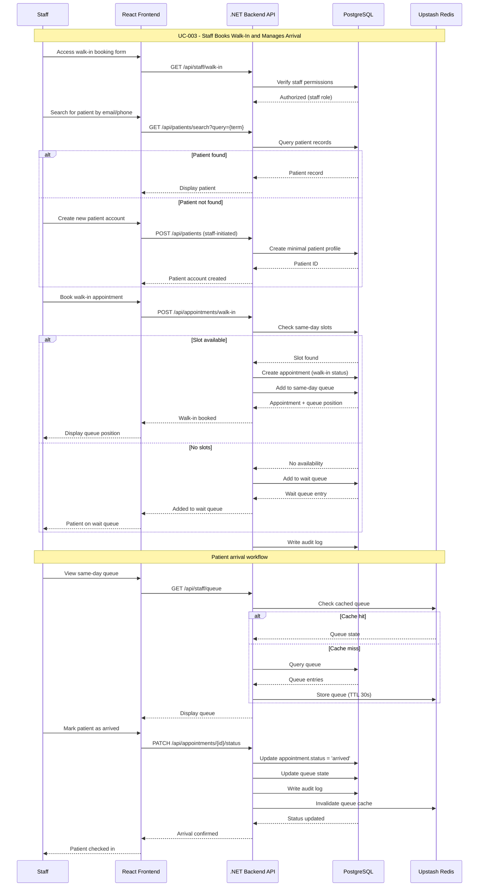

#### UC-004: Patient Uploads Historical or Post-Visit Documents
**Source**: [spec.md#UC-004](.propel/context/docs/spec.md#UC-004)

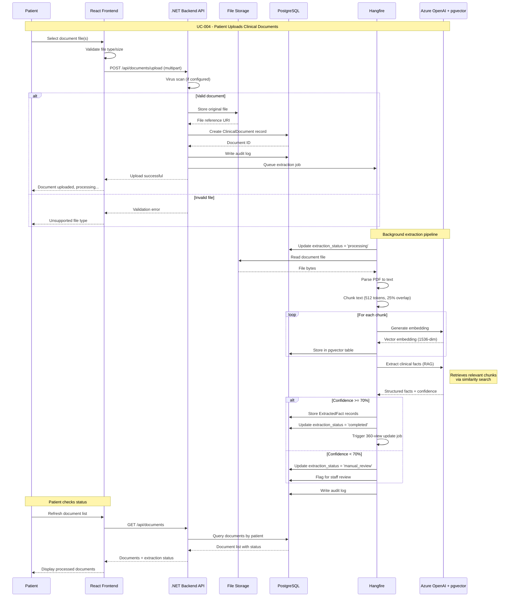

#### UC-005: Staff Verifies Extracted Data, Conflicts, and Suggested Codes
**Source**: [spec.md#UC-005](.propel/context/docs/spec.md#UC-005)

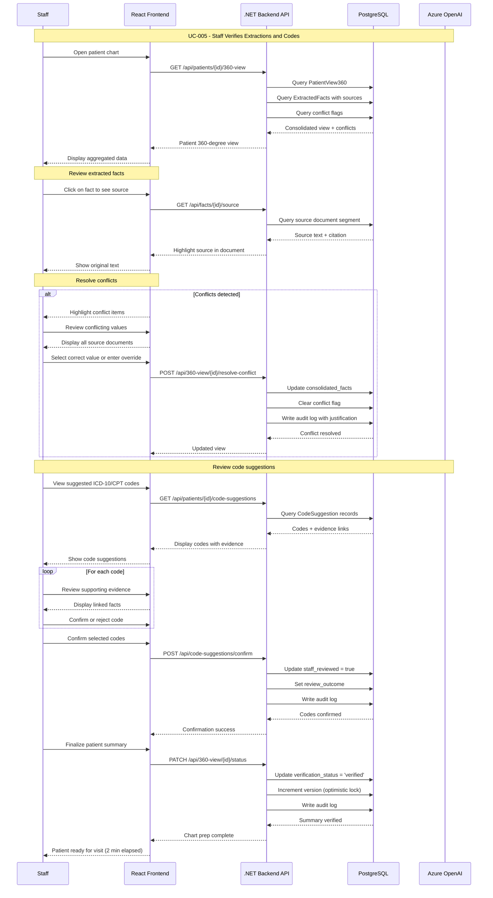

#### UC-006: Admin Manages Users and Access
**Source**: [spec.md#UC-006](.propel/context/docs/spec.md#UC-006)

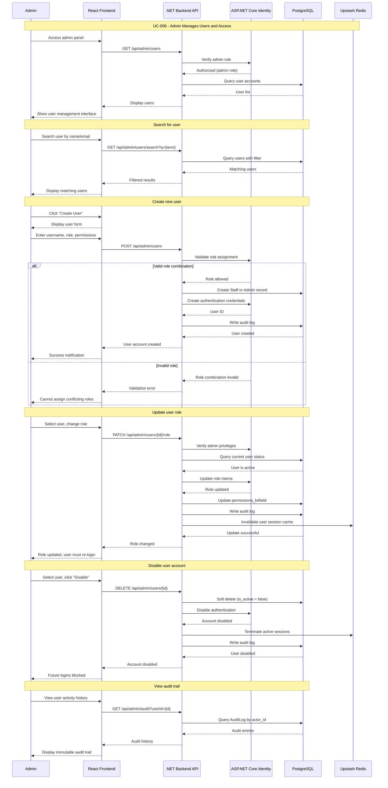
