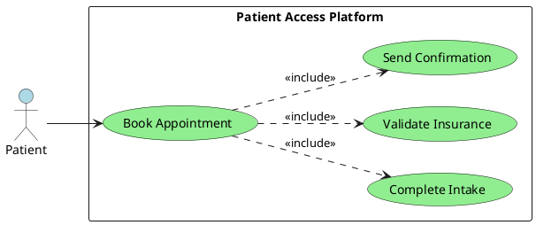
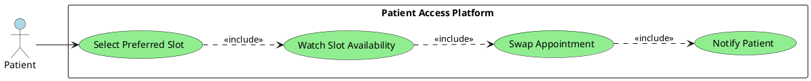
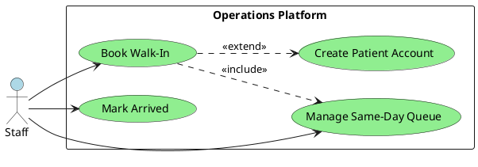
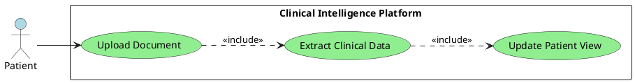
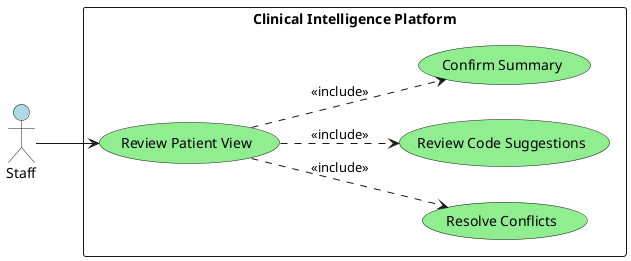
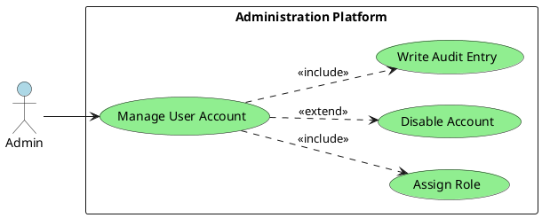

# Requirements Specification

## Feature Goal
Build a unified phase-1 healthcare platform that lets patients book and manage
appointments while giving staff a trust-first clinical intelligence workflow for
document aggregation, conflict detection, and coding review. The target end
state replaces disconnected scheduling and manual chart-prep activities with a
single workflow from booking through post-visit data consolidation.

## Business Justification
- Reduce avoidable revenue loss caused by booking friction and no-show rates of
  up to 15% described in the BRD.
- Cut staff clinical preparation effort from a manual 20+ minute document review
  exercise to a verification-oriented workflow that targets about 2 minutes.
- Close the product gap between scheduling-only systems and opaque AI tools by
  combining patient access workflows with source-linked, reviewable clinical
  intelligence outputs.
- Start from a greenfield repository with no existing application code, which
  allows the specification to define the authoritative phase-1 behavior.

## Feature Scope
Phase 1 covers patient, staff, and admin workflows only. Provider-facing
experiences, payment collection, family profiles, patient self-check-in,
bi-directional EHR integration, and full claims submission remain out of scope.

Phase-1 technology direction is constrained to the BRD-approved option set:
frontend implementation must use React or Angular, backend implementation must
use .NET or Java, and the structured data layer must use PostgreSQL or SQL
Server. Hosting must remain on free or open-source-friendly platforms such as
Netlify, Vercel, GitHub Codespaces, or equivalent environments, with paid cloud
hosting excluded for this phase.

Stakeholder map:
- Patient: book appointments, complete intake, upload documents, receive
  reminders and booking artifacts.
- Staff: manage walk-ins, same-day queues, arrivals, clinical review, and code
  verification.
- Admin: manage users, access, and operational governance.
- External systems: SMS or email delivery services, Google and Outlook calendar
  endpoints, and internal dummy insurance reference data.

Planned requirement inventory:

| Req-ID | Summary |
|-------|---------|
| FR-001 | Role-based access for patient, staff, and admin users |
| FR-002 | Self-service patient booking for available appointments |
| FR-003 | AI-assisted intake with manual fallback and edit continuity |
| FR-004 | Preferred unavailable slot selection and waitlist enrollment |
| FR-005 | Automatic preferred slot swap and released-slot management |
| FR-006 | Rule-based no-show risk scoring |
| FR-007 | Reminders, calendar sync, and PDF booking confirmation |
| FR-008 | Staff-controlled walk-in, queue, and arrival management |
| FR-009 | Insurance soft validation against dummy records |
| FR-010 | Patient document upload and association to the visit timeline |
| FR-011 | AI extraction of structured clinical data from uploaded documents |
| FR-012 | 360-degree patient view with de-duplication and source traceability |
| FR-013 | Conflict detection and explicit review of critical discrepancies |
| FR-014 | ICD-10 and CPT suggestion workflow with human confirmation |
| FR-015 | Admin and staff account management, including optional walk-in accounts |
| FR-016 | Immutable audit trail for patient and staff actions |
| FR-017 | Secure session handling and inactivity timeout enforcement |
| FR-018 | Operational metrics for no-show, adoption, and clinical accuracy |
| FR-019 | Native deployment and runtime infrastructure requirements |
| FR-020 | Free and open-source auxiliary processing and utility tooling |
| UC-001 | Patient books an appointment and completes intake |
| UC-002 | Patient requests a preferred slot swap |
| UC-003 | Staff books a walk-in and manages same-day arrival |
| UC-004 | Patient uploads historical or post-visit documents |
| UC-005 | Staff verifies extracted data, conflicts, and suggested codes |
| UC-006 | Admin manages users and access |

### Success Criteria
- [ ] Patients can complete booking, intake, and confirmation without staff
  intervention for standard appointments.
- [ ] The platform can move staff chart-prep work from manual extraction toward
  a review-first flow that targets about 2 minutes per prepared patient file.
- [ ] The system can automatically swap into a newly available preferred slot
  and release the superseded appointment slot without double-booking.
- [ ] Extracted clinical data and coding suggestions support an AI-human
  agreement rate greater than 98% before operational sign-off.
- [ ] Security controls enforce role-based access, immutable audit capture, a
  15-minute inactivity timeout, and deployment planning that supports 99.9%
  uptime targets.

## Functional Requirements
- FR-001: [DETERMINISTIC] System MUST enforce role-based access control for
  patients, staff, and admins so that patients can perform only self-service
  booking and document actions, staff can perform operational and clinical
  review actions, and admins can manage user access and governance settings.
- FR-002: [DETERMINISTIC] System MUST allow a patient to search availability,
  select an open slot, and create an appointment record with captured contact,
  visit, and insurance details in one transaction.
- FR-003: [HYBRID] System MUST provide an AI-assisted conversational intake
  option and a manual form option, allow the patient to switch between them at
  any time, and preserve previously entered answers when the patient changes
  intake mode.
- FR-004: [DETERMINISTIC] System MUST allow a patient who books an available
  slot to also select one preferred unavailable slot as a waitlisted target for
  automatic reassignment.
- FR-005: [DETERMINISTIC] System MUST monitor preferred-slot availability and,
  when the selected target slot opens, automatically move the appointment to the
  preferred slot, notify the patient, and release the previously held slot back
  to inventory without creating duplicate bookings.
- FR-006: [DETERMINISTIC] System MUST calculate a rule-based no-show risk score
  during booking using configurable scheduling and patient-response signals so
  staff can prioritize follow-up and reminder intensity.
- FR-007: [DETERMINISTIC] System MUST send automated SMS or email reminders,
  create Google and Outlook calendar events using free API integrations, and
  email a PDF appointment confirmation immediately after booking changes.
- FR-008: [DETERMINISTIC] System MUST restrict walk-in booking, same-day queue
  management, and arrival marking to staff users, optionally allow staff to
  create a patient account during walk-in intake, and prevent any patient-driven
  self-check-in through web, mobile, or QR channels.
- FR-009: [DETERMINISTIC] System MUST perform a soft validation of insurance
  name and member identifier against an internal dummy reference set and record
  pass, partial-match, or fail results without blocking appointment creation.
- FR-010: [DETERMINISTIC] System MUST let patients upload historical documents
  before the visit and visit-related documents after the visit, associate each
  file with the correct patient and encounter context, and preserve the source
  document for later review.
- FR-011: [AI-CANDIDATE] System MUST extract structured clinical facts such as
  vitals, medications, history elements, diagnoses, and procedures from
  supported uploaded documents and persist the extracted output with source
  references to the originating document segments.
- FR-012: [HYBRID] System MUST assemble a unified 360-degree patient view from
  intake data, uploaded records, and visit notes, de-duplicate overlapping facts,
  and present each consolidated value with its contributing sources for staff
  verification.
- FR-013: [HYBRID] System MUST detect clinically meaningful conflicts across
  aggregated sources, including contradictory medications or history details,
  highlight them as review items, and require staff acknowledgement before the
  patient summary is treated as verified.
- FR-014: [HYBRID] System MUST generate ICD-10 and CPT code suggestions from
  the aggregated patient data, show the evidence supporting each suggestion, and
  require staff review and confirmation before a code becomes part of the final
  patient record.
- FR-015: [DETERMINISTIC] System MUST allow admins to create, update, disable,
  and role-assign user accounts and allow authorized staff to initiate a patient
  account as part of walk-in or call-center booking workflows.
- FR-016: [DETERMINISTIC] System MUST create an immutable audit log for all
  patient, staff, and admin actions that affect appointments, intake answers,
  uploaded documents, extracted clinical data, code confirmations, and access
  administration.
- FR-017: [DETERMINISTIC] System MUST protect authenticated sessions with a
  15-minute inactivity timeout, force re-authentication after timeout, and apply
  secure handling rules for PHI in storage, transmission, and access workflows.
- FR-018: [DETERMINISTIC] System MUST expose operational reporting for booking
  volumes, completed dashboards, no-show risk distribution, no-show outcomes,
  AI-human agreement on extracted data and coding, and critical conflicts
  identified so phase-1 success criteria can be measured.
- FR-019: [DETERMINISTIC] System MUST support native deployment capabilities on
  Windows Services or IIS and define a phase-1 runtime baseline that uses
  PostgreSQL for structured data storage and Upstash Redis for caching.
- FR-020: [DETERMINISTIC] System MUST ensure that auxiliary processing,
  background processing, document handling, and supporting utility workflows use
  strictly free and open-source technology stacks and tools throughout phase 1.

## Use Case Analysis

### Actors & System Boundary
- Patient: primary actor for self-service booking, intake completion, and
  document upload.
- Staff: primary actor for walk-in operations, same-day queue handling, arrival
  updates, and clinical verification.
- Admin: primary actor for access management and governance.
- Notification and calendar services: external system actors used for reminder,
  confirmation, and scheduling synchronization.
- Insurance reference data: external system actor used for soft validation.

### Use Case Specifications
For each goal derive the use case and provide detailed specifications:

#### UC-001: Patient Books an Appointment and Completes Intake
- **Actor(s)**: Patient
- **Goal**: Reserve an appointment and submit required intake details without
  staff intervention.
- **Preconditions**: Appointment inventory exists, patient has access to the
  booking experience, and reminder delivery channels are configured.
- **Success Scenario**:
  1. Patient searches for appointment availability and selects an open slot.
  2. System captures contact, visit reason, and insurance information.
  3. Patient completes intake through conversational AI or the manual form.
  4. System performs insurance soft validation and computes no-show risk.
  5. System creates the appointment, generates the PDF confirmation, and sends
     reminder and calendar artifacts.
- **Extensions/Alternatives**:
  - 3a. Patient switches between conversational and manual intake and the system
    retains previously entered answers.
  - 4a. Insurance validation fails or partially matches and the system marks the
    booking for staff follow-up without blocking confirmation.
  - 5a. Calendar sync fails and the system preserves the appointment while
    logging the failure for retry.
- **Postconditions**: Confirmed appointment, persisted intake data, tracked
  reminder schedule, and audit entries exist.

##### Use Case Diagram

#### UC-002: Patient Requests a Preferred Slot Swap
- **Actor(s)**: Patient
- **Goal**: Secure a currently available appointment while requesting automatic
  reassignment into a preferred unavailable slot if it later opens.
- **Preconditions**: Patient has selected an available appointment and the
  preferred slot is currently unavailable but waitlist-eligible.
- **Success Scenario**:
  1. Patient books an available appointment.
  2. Patient selects one unavailable preferred slot as the swap target.
  3. System places the appointment on a preferred-slot watchlist.
  4. Preferred slot becomes available.
  5. System moves the appointment to the preferred slot, releases the original
     slot, and notifies the patient of the change.
- **Extensions/Alternatives**:
  - 2a. Preferred slot is no longer eligible and the system keeps the original
    appointment without creating a swap request.
  - 4a. Another patient claims the preferred slot first and the system leaves
    the original appointment unchanged.
  - 5a. Notification delivery fails and the system records the swap while
    flagging communication retry.
- **Postconditions**: Appointment remains booked in exactly one slot, waitlist
  status is updated, and all slot changes are audited.

##### Use Case Diagram

#### UC-003: Staff Books a Walk-In and Manages Same-Day Arrival
- **Actor(s)**: Staff
- **Goal**: Handle walk-in or call-center patients, manage same-day queue order,
  and mark patients as arrived.
- **Preconditions**: Staff user is authenticated and has booking privileges.
- **Success Scenario**:
  1. Staff searches for an existing patient or creates a new patient account.
  2. Staff books a walk-in or same-day appointment.
  3. System places the patient into the same-day operational queue.
  4. Staff updates the patient status to arrived when the patient is present.
  5. System records queue and arrival transitions for operational tracking.
- **Extensions/Alternatives**:
  - 1a. No account is created and the system stores a minimal temporary patient
    profile for later account completion.
  - 2a. No same-day slot exists and the system records the patient on a wait
    queue managed by staff.
  - 4a. Patient leaves before service and staff marks the status accordingly.
- **Postconditions**: Same-day booking and arrival state are current, and the
  patient cannot self-check in outside staff control.

##### Use Case Diagram

#### UC-004: Patient Uploads Historical or Post-Visit Documents
- **Actor(s)**: Patient
- **Goal**: Provide source documents that enrich the clinical record before or
  after a visit.
- **Preconditions**: Patient has an appointment or patient profile and document
  upload permissions are active.
- **Success Scenario**:
  1. Patient selects documents to upload.
  2. System validates file acceptance rules and stores the originals.
  3. System associates each document with the patient and encounter context.
  4. System runs extraction and creates candidate structured clinical data.
  5. System updates the unified patient view with traceable new evidence.
- **Extensions/Alternatives**:
  - 2a. Unsupported file content is rejected and the patient receives a clear
    error with allowed formats.
  - 4a. Extraction confidence is insufficient and the system flags the document
    for staff review without discarding the source file.
  - 5a. The new data conflicts with existing values and the system opens a
    conflict item for human verification.
- **Postconditions**: Source documents are preserved, extraction output is
  traceable, and the patient profile reflects pending or verified updates.

##### Use Case Diagram

#### UC-005: Staff Verifies Extracted Data, Conflicts, and Suggested Codes
- **Actor(s)**: Staff
- **Goal**: Review AI-assisted outputs and finalize a trusted patient summary.
- **Preconditions**: Patient documents or visit notes have been processed and a
  candidate 360-degree view is available.
- **Success Scenario**:
  1. Staff opens the patient summary and reviews extracted facts with sources.
  2. System highlights duplicate facts and critical conflicts.
  3. Staff resolves or acknowledges each conflict.
  4. System proposes ICD-10 and CPT codes with supporting evidence.
  5. Staff confirms accepted data points and coding suggestions.
- **Extensions/Alternatives**:
  - 1a. No extracted data is available and the system keeps the case in pending
    review status.
  - 3a. Staff rejects a conflict resolution candidate and enters a manual
    override with audit justification.
  - 5a. Staff rejects suggested codes and saves the chart without coding
    confirmation.
- **Postconditions**: Verified patient summary, conflict decisions, code review
  outcome, and audit entries are persisted.

##### Use Case Diagram

#### UC-006: Admin Manages Users and Access
- **Actor(s)**: Admin
- **Goal**: Govern who can use the system and what permissions they hold.
- **Preconditions**: Admin user is authenticated with administrative rights.
- **Success Scenario**:
  1. Admin searches for a user account.
  2. Admin creates, updates, disables, or reassigns the user's role.
  3. System validates the requested access change against allowed role models.
  4. System applies the change and records it in the audit trail.
  5. Updated permissions take effect for subsequent sessions or immediate policy
     enforcement where supported.
- **Extensions/Alternatives**:
  - 2a. Requested role combination is invalid and the system blocks the change.
  - 4a. Target user is currently active and the system forces re-authentication
    after a privilege downgrade.
  - 5a. Account is disabled and all future login attempts are rejected.
- **Postconditions**: Access model reflects the approved change and governance
  events are immutably logged.

##### Use Case Diagram

## Risks & Mitigations
- AI extraction may misread clinical source documents and create unsafe summary
  candidates; mitigate with source-linked evidence, conflict highlighting, and
  mandatory staff verification before data or codes are finalized.
- Reminder delivery or calendar synchronization failures may degrade no-show
  reduction goals; mitigate with retry logging, fallback email delivery, and
  staff-visible communication status.
- Preferred-slot swap logic may create duplicate or orphaned bookings under
  contention; mitigate with atomic slot reassignment rules and full audit trails.
- PHI exposure risk exists across uploads, notifications, and review workflows;
  mitigate with strict RBAC, encrypted transmission and storage, session timeout,
  and immutable audit coverage.
- Free-tier hosting or tooling limits may constrain reliability targets; mitigate
  by selecting open-source-friendly components that support horizontal migration
  to Windows Services or IIS deployment without changing user workflows.

## Constraints & Assumptions
- Phase 1 assumes a greenfield implementation and treats this specification as
  the system-of-record until downstream design artifacts refine technical detail.
- Hosting must remain on free or open-source-friendly platforms in phase 1, so
  paid cloud dependencies are excluded even when they could simplify operations.
- Phase-1 stack selection must stay within the BRD-approved technology options:
  React or Angular for frontend, .NET or Java for backend, and PostgreSQL or
  SQL Server for the primary relational data store.
- Provider logins, payments, family profiles, patient self-check-in, direct EHR
  write-back, and full claims submission are excluded and must not appear in
  phase-1 delivery scope.
- The solution must handle HIPAA-sensitive data with role-based access and audit
  controls, but the exact compliance implementation details are deferred to the
  architecture and security design workflows.
- Native Windows Services or IIS deployment support and the use of Upstash
  Redis for caching are mandatory BRD constraints, even if implementation
  details are elaborated in downstream architecture work.